# 🎵 Android 音乐播放器架构设计文档

## 1. 总体架构概述

音乐播放器应用采用 **MVVM (Model-View-ViewModel)** 架构模式，结合前台服务（Service）实现后台播放功能。架构设计注重模块化、可维护性和扩展性，各组件间通过接口和事件机制实现松耦合。

### 1.1 系统架构图

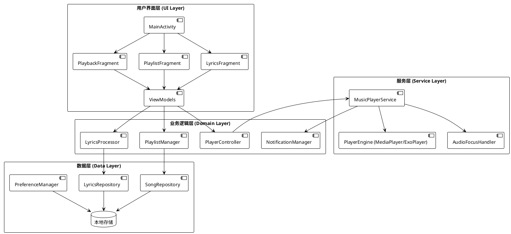

### 1.2 架构设计原则

1. **关注点分离**：UI、业务逻辑和数据处理分离，提高可维护性
2. **单一职责**：每个组件只负责单一功能，减少组件间耦合
3. **依赖注入**：使用接口和工厂模式实现组件间依赖关系
4. **观察者模式**：状态变化通过观察者模式传播，保持数据一致性
5. **生命周期感知**：组件感知 Android 生命周期，防止内存泄漏和崩溃

## 2. 模块划分结构

### 2.1 音频播放模块

音频播放模块负责音乐文件的加载、播放控制和状态管理，是整个应用的核心。

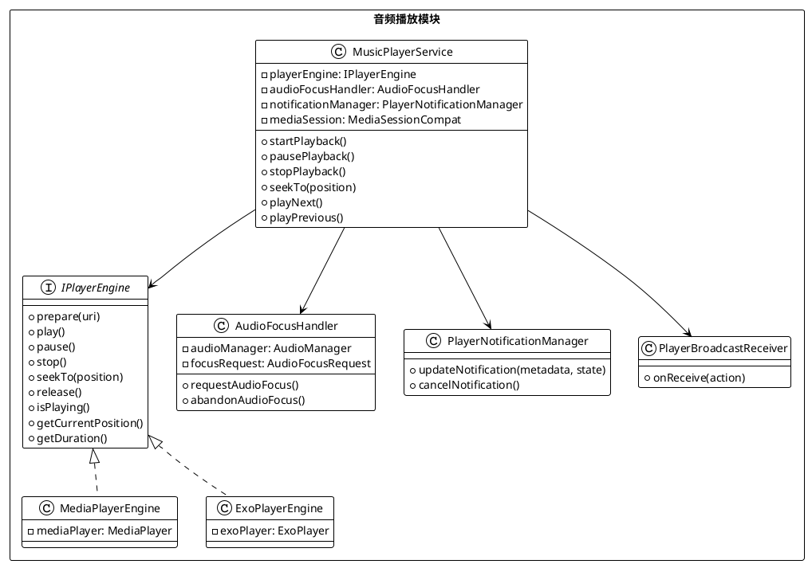

**主要组件：**

1. **MusicPlayerService**：核心服务类，管理播放生命周期，保持后台播放能力
2. **IPlayerEngine**：播放引擎接口，支持切换 MediaPlayer/ExoPlayer 实现
3. **AudioFocusHandler**：音频焦点管理，处理中断事件（来电、其他应用播放）
4. **PlayerNotificationManager**：通知管理，展示和更新播放通知
5. **PlayerBroadcastReceiver**：广播接收器，处理通知操作和媒体按钮事件

### 2.2 播放列表管理模块

负责音乐曲目数据的加载、缓存、排序和过滤等功能，提供播放列表管理能力。

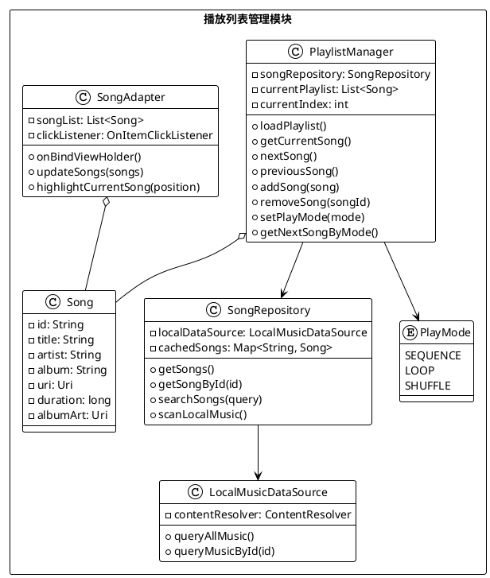

**主要组件：**

1. **PlaylistManager**：播放列表业务逻辑，管理当前播放曲目和播放模式
2. **SongRepository**：数据仓库层，统一数据访问接口，处理缓存逻辑
3. **LocalMusicDataSource**：本地数据源，通过 ContentResolver 访问音乐文件
4. **SongAdapter**：RecyclerView 适配器，负责列表 UI 展示和交互
5. **Song**：歌曲数据模型，封装歌曲元数据

### 2.3 歌词处理模块

负责 LRC 歌词文件的解析、加载、时间同步和渲染展示，实现歌词滚动和高亮功能。

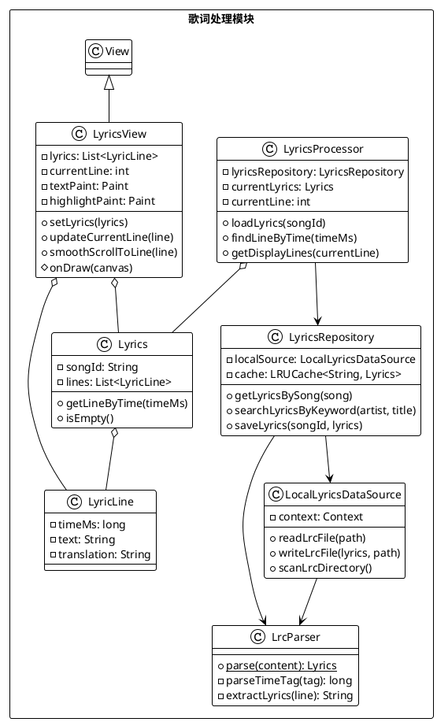

**主要组件：**

1. **LyricsProcessor**：歌词业务逻辑，控制歌词加载与同步
2. **LyricsRepository**：歌词数据仓库，实现缓存和数据访问抽象
3. **LocalLyricsDataSource**：本地歌词文件读写操作
4. **LrcParser**：LRC 文件解析器，解析时间标签和歌词文本
5. **LyricsView**：自定义 View，实现歌词展示、滚动和高亮效果
6. **Lyrics**：歌词数据模型，包含歌词行集合和查找方法
7. **LyricLine**：歌词行数据模型，包含时间戳和文本内容

### 2.4 UI 控制模块

负责用户界面交互逻辑，处理用户输入，更新界面展示，并与其他模块协调工作。

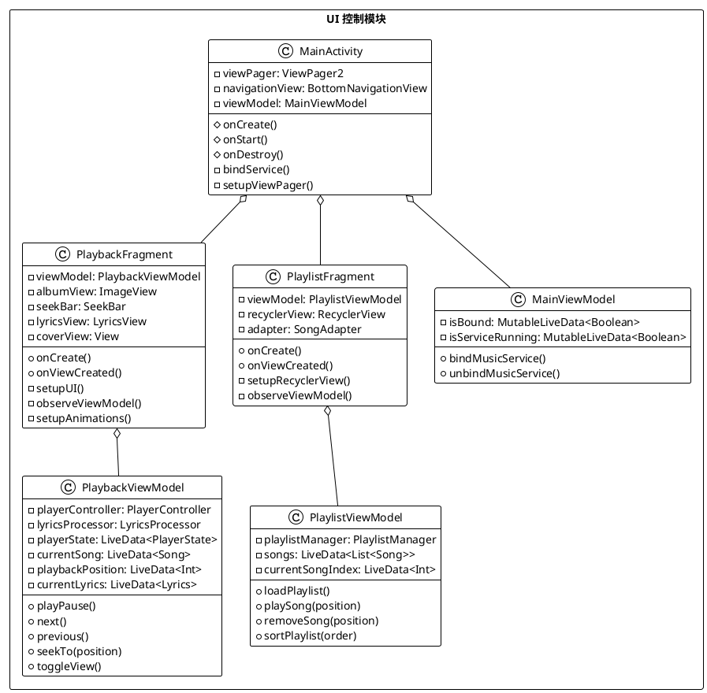

**主要组件：**

1. **MainActivity**：应用主活动，负责整体界面框架和导航逻辑
2. **PlaybackFragment**：播放控制界面，展示封面、控制按钮和进度条
3. **PlaylistFragment**：播放列表界面，展示和管理歌曲列表
4. **ViewModels**：ViewModel 类，连接 UI 和业务逻辑，管理界面状态数据
5. **动画控制器**：管理封面旋转、视图切换等动画效果

## 3. 类图与数据结构设计

### 3.1 核心类图

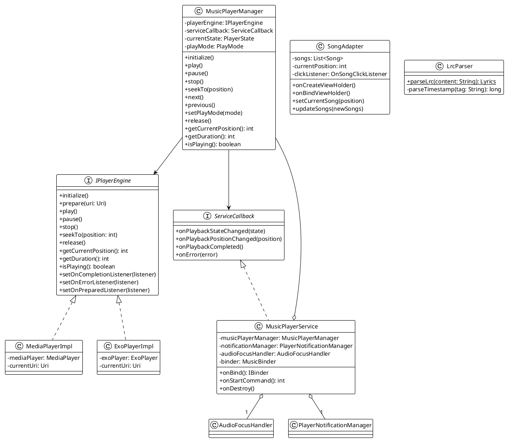

### 3.2 数据模型设计

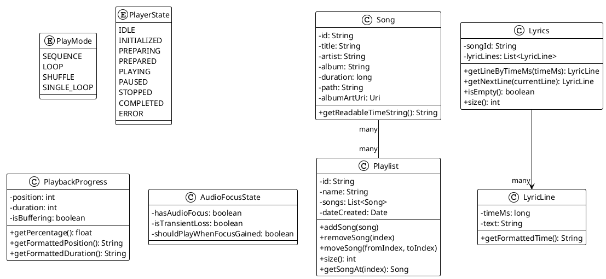

## 4. 关键流程建模

### 4.1 播放流程：加载 → 播放 → 暂停/停止

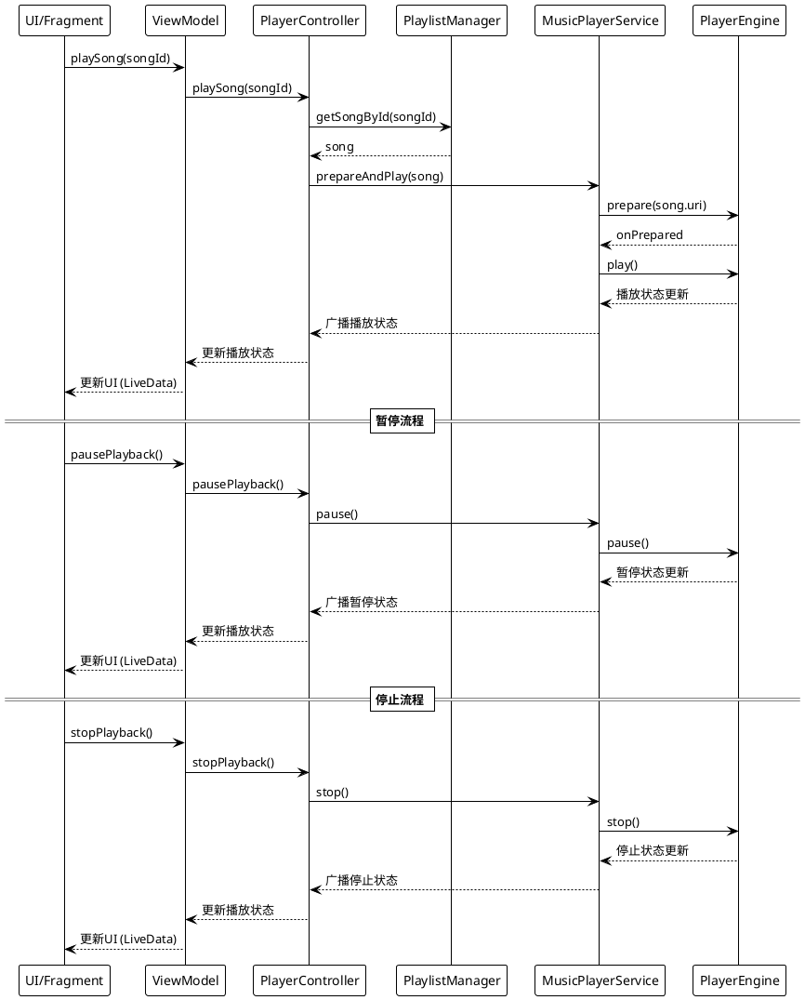

### 4.2 歌词同步流程：时间匹配 → 滚动 → 高亮

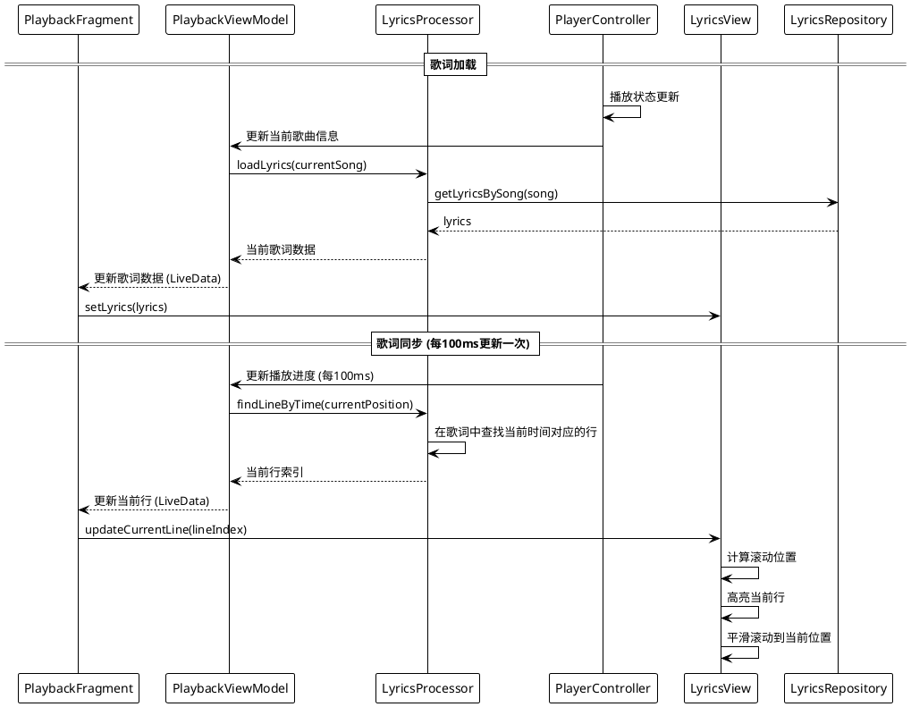

### 4.3 视图切换流程：歌词 ↔ 封面

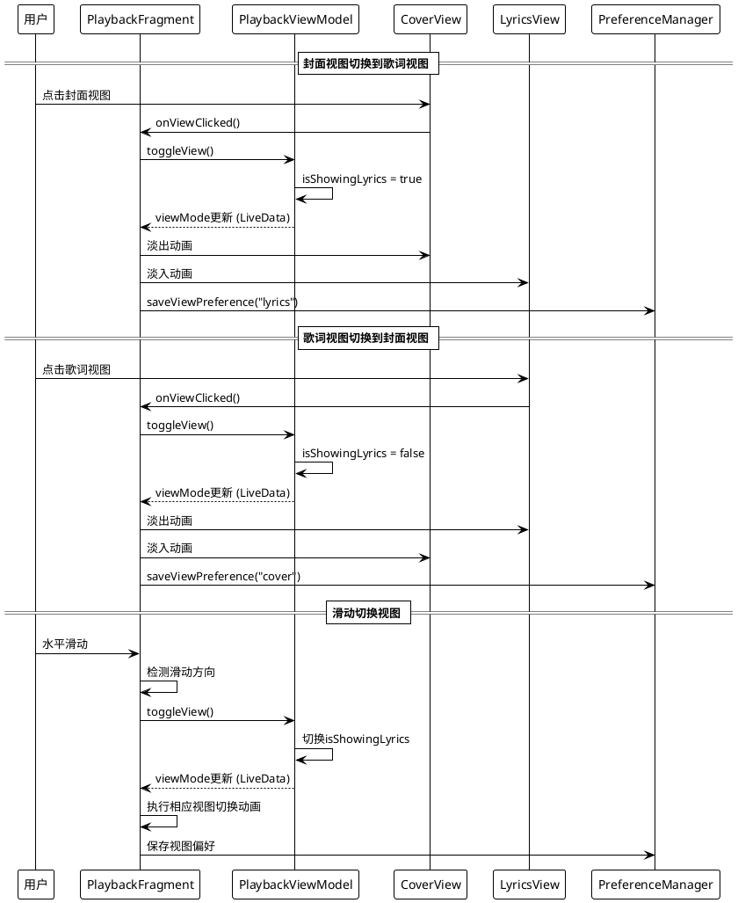

### 4.4 播放列表交互流程：点击切歌、添加删除

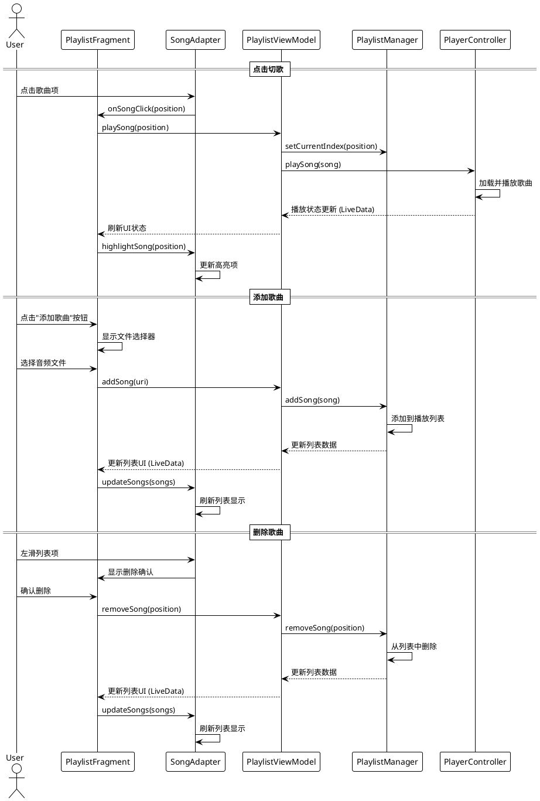

## 5. 性能优化策略

### 5.1 后台播放支持

为确保音乐在应用进入后台或屏幕关闭时仍能持续播放，采用以下策略：

1. **前台服务实现**：
   - 使用 `Service.startForeground()` 提高服务优先级
   - 配置持久通知，包含播放控制和元数据展示
   - 适配 Android 8.0+ 的通知渠道要求

2. **媒体会话集成**：
   - 使用 `MediaSessionCompat` 管理播放状态
   - 处理音频焦点争抢，响应系统音频事件
   - 支持耳机线控和系统媒体控制

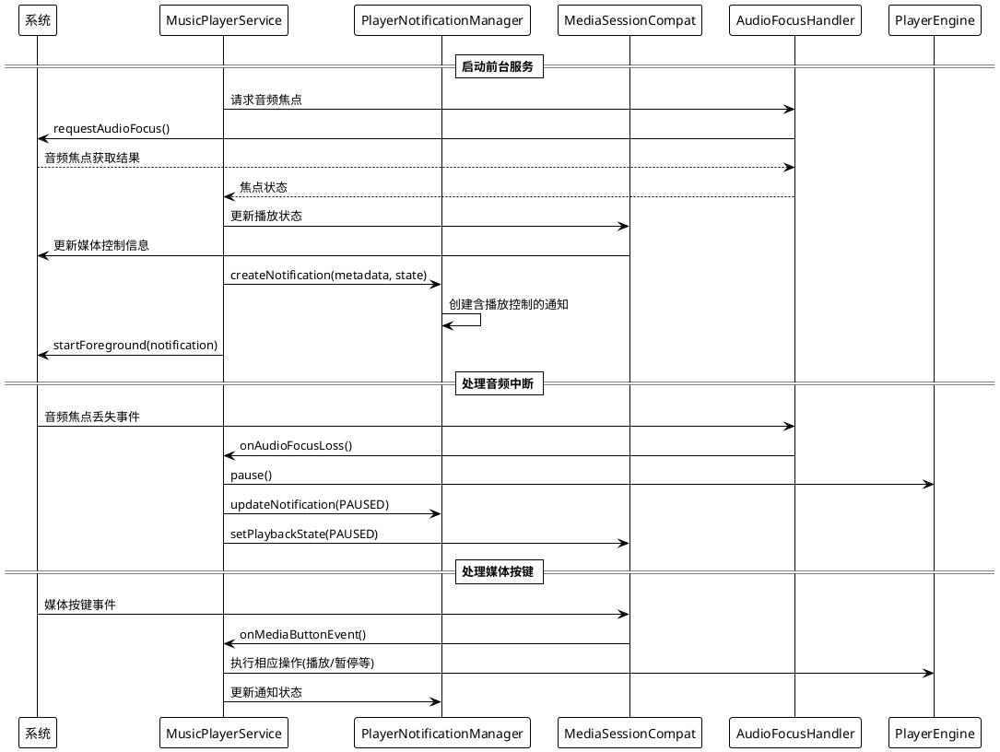

### 5.2 歌词/歌曲缓存机制

为提高应用性能，减少不必要的磁盘或网络访问，实现缓存机制：

1. **内存缓存策略**：
   - 使用 LRU 缓存存储最近使用的歌曲和歌词
   - 基于使用频率和内存压力调整缓存大小

2. **持久化缓存**：
   - 本地存储解析后的歌词结构，避免重复解析
   - 实现自定义序列化和反序列化，提高读写效率

3. **懒加载与预加载**：
   - 播放列表使用懒加载方式，仅加载可见项
   - 预加载即将播放的歌曲和歌词，提升响应速度

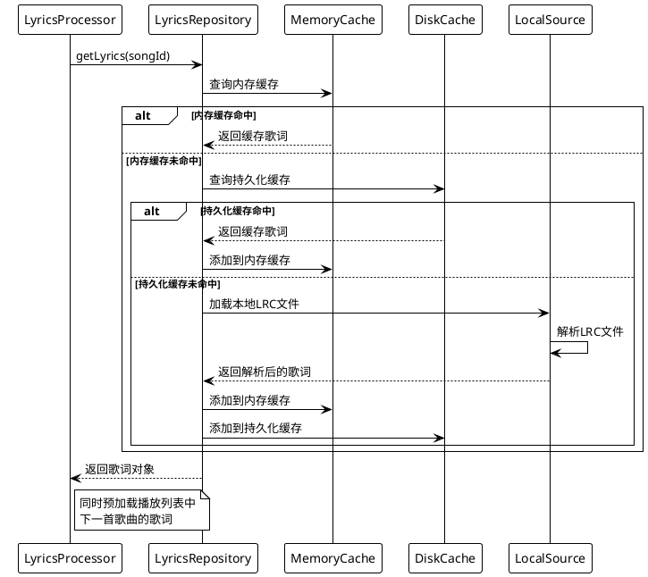

### 5.3 UI 动效与滚动流畅性优化

为保证界面流畅性和用户体验，针对动画和滚动效果进行优化：

1. **属性动画优化**：
   - 使用硬件加速提高动画性能
   - 控制动画复杂度，避免过度绘制
   - 合理使用 ValueAnimator 和 ObjectAnimator

2. **滚动优化**：
   - 实现高效歌词滚动，使用 SurfaceView 或 TextureView
   - 滚动视图使用渲染优化和回收机制
   - 避免嵌套滚动视图，减少布局层级

3. **异步处理**：
   - UI 主线程只处理交互和动画
   - 复杂计算和IO操作放入后台线程
   - 使用协程或线程池管理异步任务

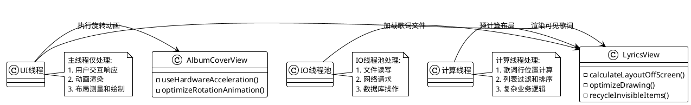

### 5.4 异常场景处理

为提高应用稳定性，实现全面的异常处理机制：

1. **播放失败恢复**：
   - 检测音频文件完整性和格式支持
   - 实现重试机制和播放失败降级策略
   - 音频解码错误时提供友好提示

2. **网络和存储异常**：
   - 监听网络状态变化，适当降级功能
   - 处理存储权限和可用空间不足情况
   - 实现断点续传和请求重试机制

3. **生命周期异常**：
   - 充分处理活动和片段生命周期
   - 避免内存泄漏和崩溃
   - 保存和恢复状态，提供无缝体验

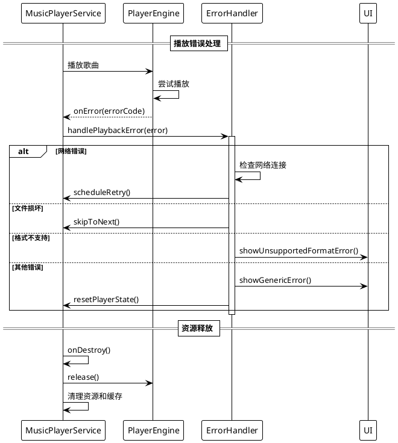

## 6. 总结

本架构设计文档详细描述了 Android 音乐播放器的软件架构、模块划分、关键流程和优化策略。设计遵循现代 Android 应用开发最佳实践，确保代码质量、可维护性和性能表现。通过模块化设计和清晰的依赖关系，应用能够灵活应对功能扩展和需求变更，同时提供流畅的用户体验。

### 6.1 实现注意事项

1. 遵循单一职责原则，各类和接口功能单一清晰
2. 依赖于抽象而非具体实现，提高代码灵活性
3. 合理处理生命周期和资源管理，避免内存泄漏
4. 异步操作使用合理的线程模型，避免阻塞主线程
5. 统一错误处理策略，提供友好的用户体验
6. 实现全面的日志和监控，便于问题排查

### 6.2 潜在改进方向

1. 支持云端音乐同步和播放
2. 集成均衡器和音效处理
3. 增强社交分享功能
4. 支持更多音频格式和播放特性
5. 添加歌词编辑功能
